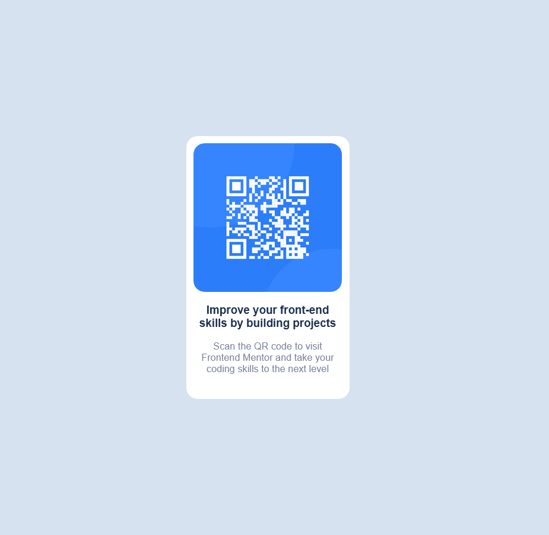

# Frontend Mentor - QR code component solution

This is a solution to the [QR code component challenge on Frontend Mentor](https://www.frontendmentor.io/challenges/qr-code-component-iux_sIO_H). Frontend Mentor challenges help you improve your coding skills by building realistic projects. 

## Table of contents

- [Overview](#overview)
  - [Screenshot](#screenshot)
- [My process](#my-process)
  - [Built with](#built-with)
  - [What I learned](#what-i-learned)
  - [Useful resources](#useful-resources)

## Overview

### Screenshot

## My process

### Built with

- Semantic HTML5 markup
- CSS custom properties
- Flexbox

### What I learned

I learnt how to put my basic HTML and CSS skills to good use for a realistic example. I admit I struggled with Flexbox, especially when centering the div vertically 😅

### Useful resources

- [Mozilla's Developer Docs](https://developer.mozilla.org/en-US/docs/Web) - This is my primary resource for learning and referencing, and it's super helpful!
- [Kevin Powell's Youtube Channel](https://www.youtube.com/@KevinPowell) - Kevin is a great guy and an enthusiastic teacher, especially regarding CSS.
